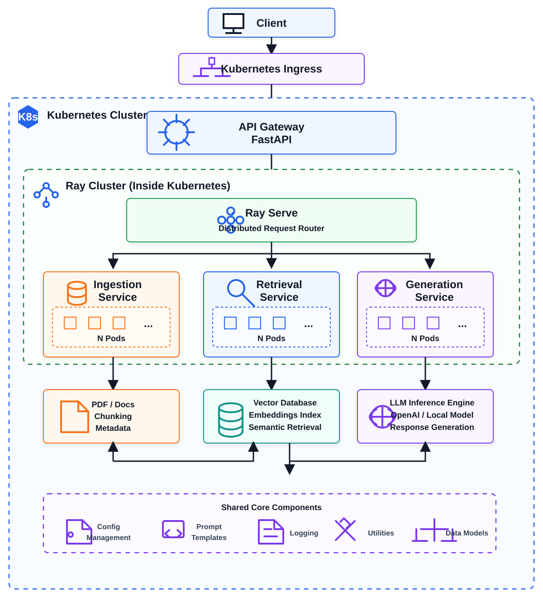

# ContextEngine: Distributed RAG Platform on Kubernetes using Ray Serve

ContextEngine is a production-style Retrieval-Augmented Generation (RAG) platform designed for scalable document-aware AI applications. The system leverages Ray Serve for distributed model serving, Kubernetes for orchestration, FastAPI for API management, and vector-based retrieval for efficient semantic search.

The project demonstrates how modern LLM systems can be architected as modular microservices that separate ingestion, retrieval, generation, and orchestration responsibilities.

---

## 1. Architecture Overview



---

## 2. Project Outcomes

1. Built a distributed Retrieval-Augmented Generation platform.
2. Designed a modular microservice architecture for AI workloads.
3. Implemented API Gateway pattern using FastAPI.
4. Integrated semantic retrieval workflows.
5. Implemented scalable LLM orchestration pipelines.
6. Containerized services using Docker.
7. Designed Kubernetes-ready deployment architecture.
8. Utilized Ray Serve for distributed request routing and scaling.
9. Structured codebase for production-style maintainability.

---

## 3. Key Features

### 3.1 Distributed Serving

1. Ray Serve based distributed request handling.
2. Horizontally scalable service architecture.
3. Separation of inference and orchestration layers.

### 3.2 Retrieval-Augmented Generation

1. Semantic document retrieval.
2. Context-aware response generation.
3. Modular retrieval pipeline.

### 3.3 Service-Oriented Design

1. API Gateway.
2. Ingestion Service.
3. Retrieval Service.
4. Generation Service.
5. Shared Core Components.

### 3.4 Kubernetes-Native Architecture

1. Containerized services.
2. Cloud deployment ready.
3. Horizontal scalability support.
4. Infrastructure abstraction.

---

## 4. Technology Stack

| Category            | Technologies    |
| ------------------- | --------------- |
| Backend             | Python, FastAPI |
| Distributed Serving | Ray Serve       |
| Containerization    | Docker          |
| Orchestration       | Kubernetes      |
| AI Architecture     | RAG             |
| Retrieval           | Vector Search   |
| API Layer           | REST APIs       |
| Deployment          | Cloud Native    |

---

## 5. Repository Structure

```text
ContextEngine/
|
+-- services/
|   +-- api-gateway/
|   +-- ingestion/
|   +-- retrieval/
|   +-- generation/
|
+-- core/
|   +-- configs/
|   +-- models/
|   +-- utilities/
|   +-- shared/
|
+-- infrastructure/
|   +-- kubernetes/
|   +-- docker/
|   +-- deployment/
|
+-- docs/
|
+-- tests/
|
+-- requirements.txt
```

---

## 6. Getting Started

### 6.1 Clone Repository

```bash
git clone https://github.com/hsb943/contextengine-distributed-rag.git

cd contextengine-distributed-rag
```

### 6.2 Install Dependencies

```bash
pip install -r requirements.txt
```

### 6.3 Start API Gateway

```bash
cd services/api-gateway

uvicorn main:app --reload
```

### 6.4 Health Check

```bash
curl http://127.0.0.1:8000/health
```

Expected Response:

```json
{
  "status": "healthy"
}
```

---

## 7. Design Principles

The project follows several production engineering principles:

1. Separation of concerns.
2. Service modularity.
3. Scalability by design.
4. Infrastructure abstraction.
5. Cloud-native deployment patterns.
6. Reusable core components.
7. Independent service evolution.

---

## 8. Potential Extensions

1. Distributed vector databases.
2. Streaming LLM responses.
3. Authentication and authorization.
4. Multi-tenant support.
5. Prometheus monitoring.
6. Grafana dashboards.
7. GPU-aware scheduling.
8. Model versioning.
9. CI/CD pipelines.

---

## 9. Learning Objectives

This project demonstrates practical experience with:

1. Distributed Systems.
2. Large Language Model Infrastructure.
3. Retrieval-Augmented Generation.
4. Ray Serve.
5. Kubernetes.
6. FastAPI.
7. Microservice Architecture.
8. Cloud-Native Application Design.

---

## 10. License

This repository is intended for educational, research, and portfolio purposes.
